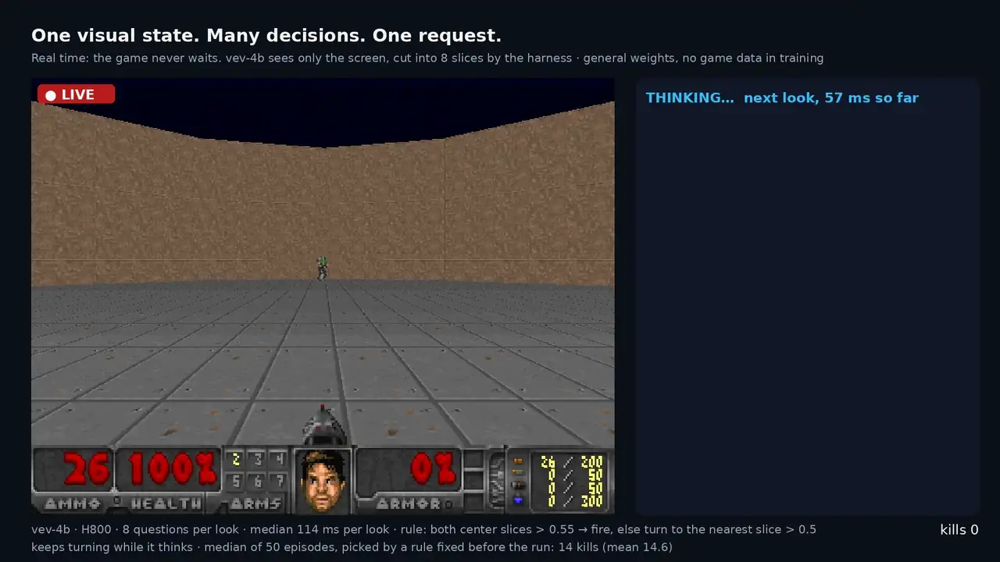
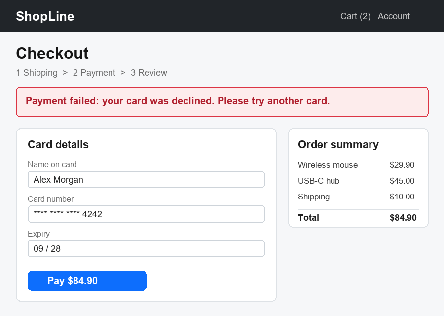

# Vev

[](README.md) [](README_zh.md) [](https://huggingface.co/collections/CountingSheep/vev) [](https://huggingface.co/spaces/CountingSheep/vev)

**Jev-like decision models that can also see images.**



vev-4b playing Doom in real time. A small harness cuts each frame into 8 vertical slices and asks Vev one yes/no
question per slice in a single request ("does this slice show a monster?"); a fixed rule turns the answers into
turning and firing. The game never waits for the model.

Ask yes/no, multiple-choice or graded questions about a piece of text, a JSON record or a screenshot, and get a
probability for every allowed answer back in about 40 ms. Nothing is generated, so the answer is always one of the
options you defined, and you can put a threshold on it. The weights are open and run on your own GPU.

- **Speaks the Jev API.** [Jev](https://typesafe.ai/blog/introducing-system-one-models-and-jev) is TypeSafe's hosted
  decision model. Vev serves the same `/v1/systemone` request format, so code written with TypeSafe's SDK works after
  changing the base URL.
- **Sees images.** Screenshots and photos go into the request next to text. We measured it on reading UI state,
  checking images against a written policy and checking generated images against their prompt
  ([what it can do](#what-it-can-do)).
- **Two sizes, English and Chinese.** `vev-4b` needs about 10 GB of GPU memory and `vev-9b` about 19 GB. Both are
  fine-tuned from Qwen3.5.



```python
resp = client.system_one(
    state={"screen": {"image": {"url": checkout_png}}},
    questions={
        "error": Noul(instructions="Does the screen show an error message?"),
        "step": Choice(instructions="Which checkout step is the user on?",
                       criteria={"shipping": None, "payment": None, "review": None}),
        "next": Choice(instructions="What should the user do next?",
                       criteria={"retry": "Try another card", "wait": "Wait for the order to ship",
                                 "nothing": "Nothing, the order went through"}),
    },
)
# vev-4b:  error 0.991
#          step  {"shipping": 0.005, "payment": 0.765, "review": 0.229}
#          next  {"retry": 0.983, "wait": 0.004, "nothing": 0.014}
```

The step question gets a less certain answer than the other two, which is what the probabilities are for: the
progress bar shows both "Payment" and "Review".

This is v0.1, a research preview. The weights are for non-commercial use only, and on most text sets Vev is less
accurate than Jev; see [limitations](#limitations).

## Get started

```bash
pip install git+https://github.com/Xiaooolong/vev
vev serve --model CountingSheep/vev-4b          # downloads the weights on first start, listens on 127.0.0.1:8009
```

You need Python 3.11 or newer, an NVIDIA GPU and a CUDA build of PyTorch; CPU and Apple Silicon are untested. On
Windows, pip installs a CPU-only PyTorch by default, so install `torch` and `torchvision` together from
[pytorch.org](https://pytorch.org/get-started/locally/) first. Tested with torch 2.8.0, transformers 5.17.0 and
peft 0.21.0.

Then ask questions with TypeSafe's Python SDK (`pip install typesafe-sdk`):

```python
from typesafe_sdk import Choice, Noul, TypeSafeClient

client = TypeSafeClient(api_key="local", base_url="http://127.0.0.1:8009")
resp = client.system_one(
    state="Order #4411 still shows 'label created' after 9 days. I need it before Friday.",
    questions={
        "urgent": Noul(instructions="Is the customer asking for something time-sensitive?"),
        "team": Choice(instructions="Which team should handle this?",
                       criteria={"shipping": "Delivery and tracking", "billing": "Charges and refunds"}),
    },
)
print(resp.answers["urgent"].noul)          # probability of "yes": 0.98 with vev-4b
print(resp.answers["team"].probabilities)   # {"shipping": 0.97, "billing": 0.03}
```

`Noul` is the API's name for a yes/no question. The state can be a string or any JSON object; an image is an
object `{"image": {"url": "data:image/png;base64,..."}}` anywhere inside it:

```python
import base64

checkout_png = "data:image/png;base64," + base64.b64encode(open("docs/checkout.png", "rb").read()).decode()
```

### Other ways to run it

- `--model CountingSheep/vev-4b-lora` downloads only the adapter (130 MB) and applies it to `Qwen/Qwen3.5-4B`,
  which is reused if it is already in your Hugging Face cache. `--revision v0.1.0` pins the weights.
- Docker: `docker build -t vev .` in a clone of this repository, then
  `docker run --gpus all -p 8009:8009 -v ~/.cache/huggingface:/root/.cache/huggingface vev --model CountingSheep/vev-4b`.
- Without the HTTP server, for example to score a large file offline:

  ```python
  from vev.model import CheckpointEngine

  engine = CheckpointEngine("CountingSheep/vev-4b")
  result = engine.run({"ticket": "My kettle never arrived."},
                      {"refund": {"type": "noul", "instructions": "Is the customer asking for a refund?"}})
  print(result.answers["refund"]["noul"])
  ```

- In another inference engine: [spec/systemone-api.md](spec/systemone-api.md), section 10, gives the prompt
  template and which token probabilities to read.

### Speed

All questions of a request run as one batch. On one H800, `vev-4b` answers:

| Request | 1 question | 10 questions | 100 questions |
|---|---|---|---|
| short text | 38 ms | 58 ms | 232 ms |
| 7k-token text | 280 ms | 334 ms | 1.07 s |
| one 1 MP image | 78 ms | 120 ms (25 questions: 143 ms) | — |

`vev-9b` is up to 30% slower; the full curves are in `conformance/results/vev-*/curves.json`. A `vev serve`
process handles one request at a time and queues the rest; for more throughput, run one process per GPU behind a
load balancer.

## What it can do

Accuracy on human-labelled data, by the kind of question. The text sets are public benchmarks; the image tasks are
judgment sets we converted from labelled public data ([details](#detailed-results)).

| Kind of question | Example | vev-4b | vev-9b |
|---|---|---|---|
| Jev-style decisions on text | JevBench public subset | 0.766 | 0.823 |
| The same, on sources the model has not seen | kev transfer-v4 | 0.776 | 0.781 |
| Chinese | judgekit | 0.962 | 0.938 |
| Pairs where a small change flips the answer | nimble | 0.707 | 0.747 |
| UI state in an app screenshot | "Is there a switch or checkbox that is turned on?" / "Is there a text input field?" | 0.928 / 0.951 | 0.923 / 0.955 |
| An image against a written safety policy | the LlavaGuard policy categories (hate, violence, sexual content, ...) | 0.742 | 0.724 |
| A generated image against its prompt | "Does the image show the element 'grass' as the prompt describes?" | 0.715 | 0.703 |
| General questions about a photo | MMBench-EN / POPE / MMStar | 0.881 / 0.889 / 0.627 | 0.902 / 0.897 / 0.674 |
| Bugs in game screenshots | glitch / object clipping (VideoGameQA-Bench) | 0.613 / 0.671 | 0.626 / 0.729 |

UI-state questions are the most accurate; policy checks, generated-image checks and the harder visual benchmarks
are mid-range; game bugs are too weak to rely on. These numbers describe these data sets, not yours. To check Vev
on your own questions, write a few hundred labelled examples in the [record format](evals/README.md) and run
`python -m evals.run` against your server; it reports accuracy, calibration, and accuracy among the most confident
answers at each coverage level.

## Detailed results

All numbers are accuracy on the full sets, measured with the harness in `evals/`. Where two systems are compared,
the difference is tested with a paired bootstrap over the same questions (95% interval); "n.s." marks differences
whose interval includes zero; for the image sets, questions that share an image are resampled together. The results
were computed with version 0.1.0, which ran one forward pass per question; 0.1.1 gives the same probabilities for
requests with one question, and with 5 or 50 extra questions per request no significance verdict below changes.
Per-set metrics, including Brier score and calibration error, are in [results/](results/); sets there that are not
below were used for diagnostics during development.

### Text

| Set | n | kev-4B | vev-4b | vev-9b | Jev |
|---|---|---|---|---|---|
| [judgekit](https://github.com/lexingtonhibiki/judgekit) (Chinese) | 130 | 0.846 | 0.962 | 0.938 | 0.962 |
| [JevBench](https://github.com/fstandhartinger/jevbench) (public subset) | 231 | 0.719 | 0.766 | 0.823 | 0.861 |
| [nimble](https://github.com/bespokelabsai/nimble) | 324 | 0.735 | 0.707 | 0.747 | 0.923 |
| [kev](https://github.com/jaredpalmer/kev) transfer-v4 (held-out sources) | 1528 | 0.802 | 0.776 | 0.781 | 0.854 |

kev-4B was run locally with the same harness. Jev was queried through TypeSafe's API (`jev-latest`, 23–24 September
2026); no Jev outputs were used for training. Differences in accuracy points:

- vev-4b against kev-4B: +11.5 on judgekit, −2.6 on kev transfer-v4; JevBench and nimble are n.s.
- vev-9b against kev-4B: +9.2 on judgekit, +10.4 on JevBench, −2.1 on kev transfer-v4; nimble is n.s.
- vev-4b against Jev: −9.5 on JevBench, −21.6 on nimble, −7.8 on kev transfer-v4; judgekit is a tie.
- vev-9b against Jev: −17.6 on nimble, −7.3 on kev transfer-v4; judgekit (−2.3) and JevBench (−3.9) are n.s.

### Before and after fine-tuning

The base model, read the same way without fine-tuning (zero-shot), against Vev:

| Set | n | Qwen3.5-4B | vev-4b | Qwen3.5-9B | vev-9b |
|---|---|---|---|---|---|
| judgekit | 130 | 0.962 | 0.962 | 0.938 | 0.938 |
| JevBench | 231 | 0.758 | 0.766 | 0.805 | 0.823 |
| nimble | 324 | 0.710 | 0.707 | 0.710 | **0.747** |
| kev transfer-v4 | 1528 | 0.758 | **0.776** | 0.764 | **0.781** |
| MMBench-EN | 1164 | 0.872 | 0.881 | 0.887 | **0.902** |
| POPE | 9000 | 0.894 | *0.889* | 0.894 | 0.897 |
| MMStar | 1498 | 0.544 | **0.627** | 0.608 | **0.674** |

Bold marks a significant improvement, italics a significant drop.

### Images

Public vision benchmarks mostly ask questions about an image. Vev is meant for judging an image against a stated
rule, so we built judgment sets from human-labelled public data. The converters are in `evals/datasets/`; the
converted data is not redistributed. Jev's API takes text only, so there is no Jev column here.

| Set | What is judged | n | Qwen3.5-4B | vev-4b | Qwen3.5-9B | vev-9b |
|---|---|---|---|---|---|---|
| policy_mod | Does the image violate this safety policy? (LlavaGuard) | 659 | 0.686 | **0.742** | 0.666 | **0.724** |
| game_glitch | Does the game screenshot contain a glitch? (VideoGameQA-Bench) | 1000 | 0.646 | 0.613 | 0.577 | **0.626** |
| game_clip | Is the object clipping into the character? (VideoGameQA-Bench) | 686 | 0.561 | **0.671** | 0.736 | 0.729 |
| ui_toggle | Is there a switch turned on / off? (MobileViews) | 800 | 0.901 | **0.928** | 0.921 | 0.923 |
| ui_input | Is there a text input field? (MobileViews) | 800 | 0.949 | 0.951 | 0.948 | 0.955 |
| t2i_elem | Does the generated image show this prompt element? (EvalMuse) | 1027 | 0.690 | **0.715** | 0.733 | 0.703 |

## Limitations

- The probabilities rank answers well but are not exact frequencies: expected calibration error ranges from 0.01
  to 0.14 depending on the task (Jev: 0.04–0.07 on the text sets). On "is something wrong here?" questions Vev
  says "no" more often than the labels do. If you act on a threshold, choose it on your own labelled data
  ([how](#what-it-can-do)).
- Reversing the order of the options changes the top answer on 13% (`vev-9b`) and 17% (`vev-4b`) of JevBench and
  kev transfer-v4 questions, against 10–12% for kev-4B and under 4% for Jev. Keep the option order fixed in your
  application.
- Judgments that need several steps of reasoning are weaker than the base model's own answer when it may think
  first: on one internal scenario set (not released), by 4–8 points. On most public sets we tried, the single pass
  was as accurate or better.
- A question asked together with others gets probabilities up to a few hundredths away from asking it alone (bf16
  rounding; p99 0.025), and a different top answer on at most 0.8% of questions. The same request always returns
  the same answer ([spec §6](spec/systemone-api.md#6-semantic-guarantees)).
- Long texts gain little from batching: with a 7k-token text, 100 questions take 3.8 times as long as one. A text
  near the 32k-token limit does not fit on a 24 GB GPU with `vev-9b`. The first request with a new length or batch
  shape can take a few seconds while GPU kernels are tuned.
- The image sets are our own conversions of public data, not established benchmarks.
- Compatible means the request and response formats match `/v1/systemone`; it does not mean Vev behaves like Jev.
  Vev is not affiliated with or endorsed by TypeSafe.

## How it works

Each question becomes a prompt with the state, the question and the lettered options, and Vev reads the model's
next-token probabilities for the answer tokens (Yes/No, option letters, level digits), renormalised over the
allowed answers. Fine-tuning (LoRA on Qwen3.5) adjusts those probabilities; there is no separate classifier head.

| Document | Contents |
|---|---|
| [spec/systemone-api.md](spec/systemone-api.md) | request format, limits, errors, guarantees, the prompt template |
| [TRAINING.md](TRAINING.md) | training recipe, data sources and their licenses, what cannot be rebuilt |
| [evals/](evals/README.md) | converting the evaluation sets and running them against any `/v1/systemone` server |
| [conformance/](conformance/README.md) | checking an implementation against the spec, including the official API |

| Model | Base | Hugging Face |
|---|---|---|
| `vev-4b` | Qwen3.5-4B | [CountingSheep/vev-4b](https://huggingface.co/CountingSheep/vev-4b) (merged), [CountingSheep/vev-4b-lora](https://huggingface.co/CountingSheep/vev-4b-lora) (adapter) |
| `vev-9b` | Qwen3.5-9B | [CountingSheep/vev-9b](https://huggingface.co/CountingSheep/vev-9b) (merged), [CountingSheep/vev-9b-lora](https://huggingface.co/CountingSheep/vev-9b-lora) (adapter) |

## License

Code: Apache 2.0. Model weights: CC BY-NC 4.0, non-commercial use only, because some training data is licensed for
research use; the sources and their terms are listed in [TRAINING.md](TRAINING.md).

## Citation

```bibtex
@software{vev2026,
  title  = {Vev: Jev-like decision models that can also see images},
  author = {Wang, Xiaolong},
  year   = {2026},
  url    = {https://github.com/Xiaooolong/vev},
  version = {0.1.1}
}
```
